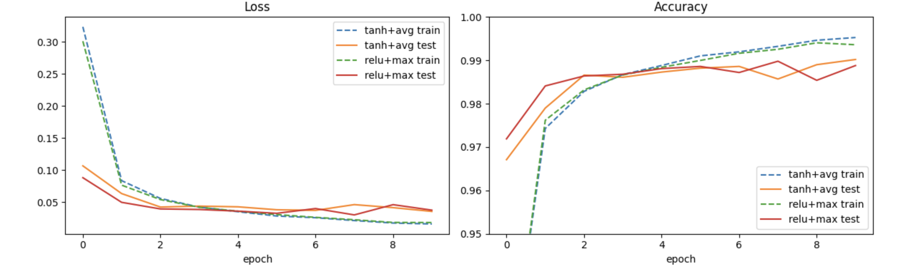
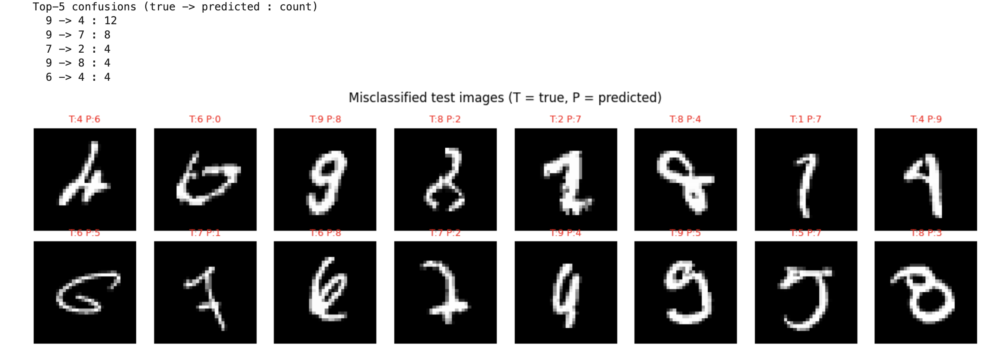
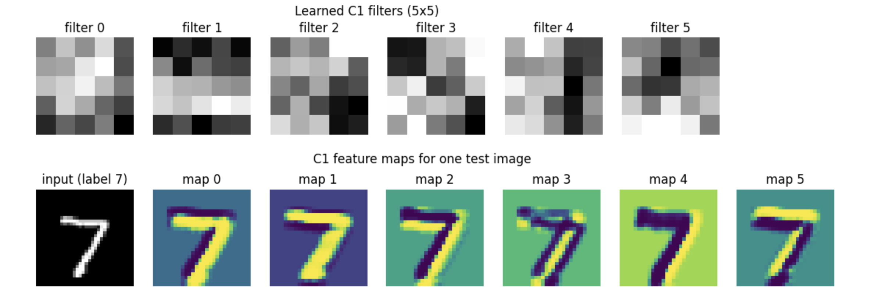

# LeNet-5 on MNIST (PyTorch)

From-scratch PyTorch implementation of the classic **LeNet-5** (LeCun et al., 1998), trained on MNIST. I compare the original design (tanh + average pooling) against a modern variant (ReLU + max pooling) under identical hyperparameters and seed.

**Kaggle notebook:** _TODO: paste your Kaggle link here_
**Paper:** *Gradient-Based Learning Applied to Document Recognition* (LeCun, Bottou, Bengio, Haffner, 1998)

## Highlights
- Reproduced the architecture exactly: **61,706 parameters** (verified with an assertion in code).
- Reached **99.02% test accuracy** with the original tanh + AvgPool design.
- Compared two variants, with per-class metrics, confusion matrix, error analysis, and learned filter visualization.

## Problem
Classify 28x28 grayscale handwritten digits (0-9). 60,000 training and 10,000 test images.

## Architecture

| Layer | Type | Output shape | Params |
|-------|------|--------------|--------|
| Input | - | 1x32x32 | 0 |
| C1 | Conv 5x5, 6 filters | 6x28x28 | 156 |
| S2 | Pool 2x2 | 6x14x14 | 0 |
| C3 | Conv 5x5, 16 filters | 16x10x10 | 2,416 |
| S4 | Pool 2x2 | 16x5x5 | 0 |
| C5 | Conv 5x5, 120 filters | 120x1x1 | 48,120 |
| F6 | Fully connected | 84 | 10,164 |
| Output | Fully connected | 10 | 850 |
| **Total** | | | **61,706** |

**Key ideas**
- **Local receptive fields + weight sharing:** each 5x5 kernel is a learnable 2D FIR filter applied across the whole image (cross-correlation), giving translation equivariance with few parameters.
- **Pooling:** low-pass filtering followed by downsampling; adds tolerance to small shifts.
- **Feature hierarchy:** strokes/edges -> digit parts -> full digits.

MNIST images are zero-padded from 28x28 to 32x32 to match the paper's input size. As in most modern implementations, C3 uses full connectivity instead of the paper's sparse connection table.

## Training setup
- Loss: Cross-Entropy | Optimizer: Adam (lr = 1e-3)
- Batch size 128 | 10 epochs | seed 42
- Normalization: mean 0.1307, std 0.3081
- No data augmentation, no regularization

## Results

| Variant | Final test acc | Best test acc | Final test loss | Epochs to 98% | Train time (s) |
|---------|---------------|---------------|-----------------|---------------|----------------|
| tanh + AvgPool (original) | **99.02%** | 99.02% | **0.0358** | 3 | 182.2 |
| ReLU + MaxPool (modern) | 98.88% | 98.98% | 0.0377 | **2** | 178.0 |



<!-- After downloading your Kaggle outputs, put these files in images/ and uncomment:


-->

### Per-class performance (best model, tanh + AvgPool)

| Digit | Precision | Recall | F1 |
|-------|-----------|--------|-----|
| 0 | 0.9959 | 0.9908 | 0.9934 |
| 1 | 0.9930 | 0.9956 | 0.9943 |
| 2 | 0.9942 | 0.9884 | 0.9913 |
| 3 | 0.9883 | 1.0000 | 0.9941 |
| 4 | 0.9818 | 0.9908 | 0.9863 |
| 5 | 0.9944 | 0.9910 | 0.9927 |
| 6 | 0.9906 | 0.9864 | 0.9885 |
| 7 | 0.9808 | 0.9942 | 0.9874 |
| 8 | 0.9888 | 0.9928 | 0.9908 |
| 9 | 0.9949 | 0.9713 | 0.9829 |

Macro F1 = 0.9902.

## Analysis

**Variant comparison.** The two variants end up very close: 99.02% (original) vs 98.88% (modern), a gap of 14 images out of 10,000. The modern variant reached 98% accuracy one epoch earlier (epoch 2 vs 3), which is consistent with ReLU avoiding the saturation that slows tanh early in training. However, the original design finished with slightly higher accuracy and lower test loss. Since this is a single run per variant with one seed, the final gap is within what I would expect from run-to-run noise, so I cannot claim that either variant is better on MNIST. MNIST is also too easy to separate such small architectural differences. Training time was nearly identical (~180 s), and for a model this small the cost is dominated by data loading rather than compute.

**Per-class behavior.** Performance is uniformly high (all F1 > 0.98). The weakest class is **digit 9** (recall 0.9713, F1 0.9829): about 3% of true 9s are predicted as something else. The lowest precisions belong to **7** (0.9808) and **4** (0.9818), which suggests that wrongly classified 9s tend to land in those classes, which makes sense since 4, 7 and 9 share similar strokes (a closed or semi-closed top with a vertical stem). Digit **3** has perfect recall (1.0000) but lower precision (0.9883), meaning the model slightly over-predicts 3 and some other digits get mistaken for it. The confusion matrix confirms this: the two most frequent errors are **9 -> 4 (12 cases)** and **9 -> 7 (8 cases)**, followed by 7 -> 2, 9 -> 8 and 6 -> 4 (4 cases each). Looking at the misclassified images, many of the errors are genuinely ambiguous or unusual handwriting (a heavily slanted or rotated 6 that looks like a 0, a 4 with a closed top that resembles a 9, a 7 with a crossbar that resembles a 2), where even a human reader could hesitate. This suggests the model is close to the ceiling of what a small CNN without augmentation can achieve on MNIST, and that the remaining errors are mostly hard samples, not systematic bugs.



**Learned features.** The six 5x5 filters in C1 are coarse and not perfectly clean (5x5 is a very small support), but they behave as oriented stroke/edge detectors. For example, filter 1 has dark pixels on top and bright pixels at the bottom (a horizontal-edge detector), while filter 4 has a dark vertical band on the right (a vertical-edge detector). In the feature maps for a test "7", maps 0, 1 and 5 respond strongly to the horizontal top bar, maps 2 and 4 respond to the boundaries of the diagonal stroke, and map 3 produces a double-edge outline of the stroke. Some maps are polarity-inverted versions of each other (bright vs. dark stroke), which is expected since filters can learn positive or negative weights. Together, C1 decomposes the digit into horizontal and diagonal stroke components that deeper layers combine.



**Generalization.** Train accuracy keeps climbing to about 99.5% while test accuracy plateaus around 98.7-99.0% after epoch ~3-4. Likewise, train loss keeps decreasing (to ~0.015) while test loss flattens around 0.035-0.045. The gap of roughly 0.5 percentage points indicates mild overfitting that starts after the first few epochs, not severe overfitting. Test curves are also noisy from epoch to epoch (swings of about 0.2-0.3 pp, especially for ReLU + MaxPool), which is another reason not to over-interpret the small final difference between the two variants. Early stopping, augmentation or regularization would be natural next steps.

## Limitations
- Single run per variant, so no confidence intervals; differences below ~0.2% are not conclusive.
- MNIST is nearly saturated, and a harder dataset would better separate the designs.
- No augmentation, regularization, or LR scheduling.
- Fully connected C3 instead of the paper's sparse connection table.

## What I would improve
- Run 5 seeds per variant and report mean +/- std
- Add augmentation (small shifts/rotations) and test robustness to shifted digits
- Add BatchNorm / Dropout and an LR scheduler (e.g. OneCycle)
- Repeat on Fashion-MNIST and CIFAR-10 to compare the variants where the difference matters

## What I learned
- How convolution, pooling and weight sharing reduce parameters while building a feature hierarchy
- How to verify an implementation (parameter count, shape tracing) against a paper
- Why single-run differences on an easy benchmark should be interpreted carefully

## Reproduce
```bash
pip install -r requirements.txt
python lenet5_mnist.py          # script version
# or open lenet5_mnist.ipynb (Jupyter / Kaggle / Colab)
```

## References
- LeCun, Y., Bottou, L., Bengio, Y., Haffner, P. (1998). *Gradient-Based Learning Applied to Document Recognition.* Proceedings of the IEEE.
