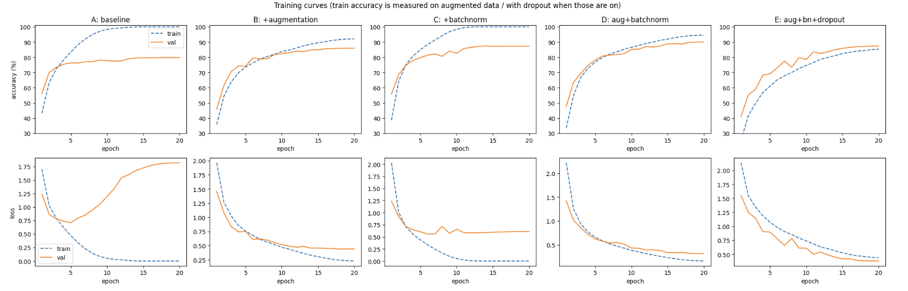
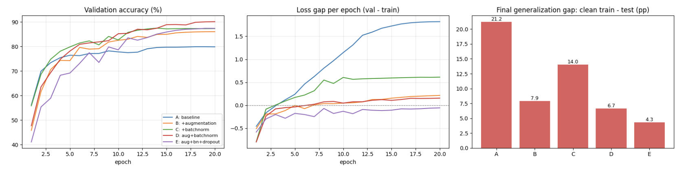
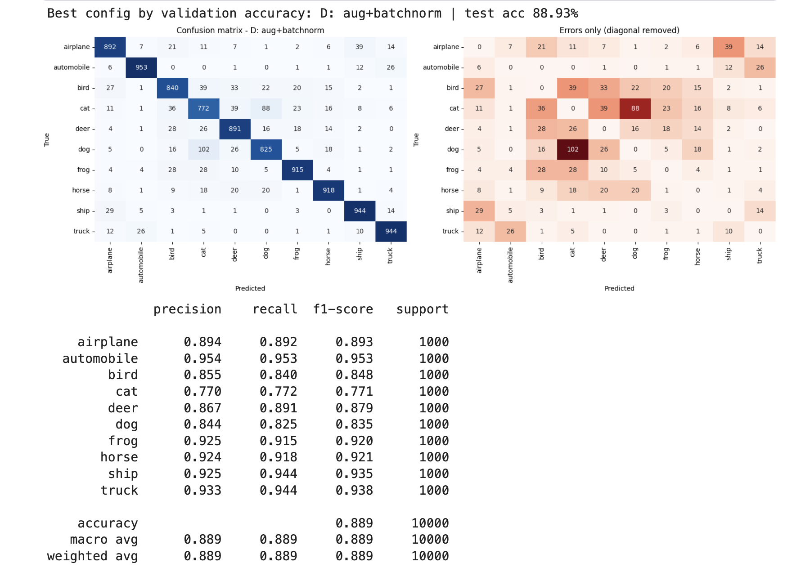
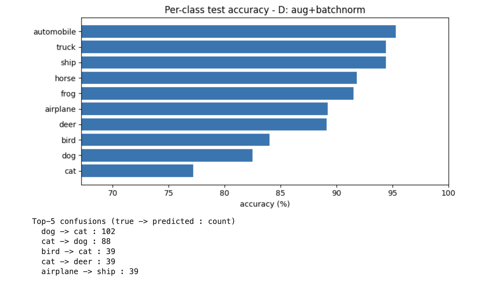
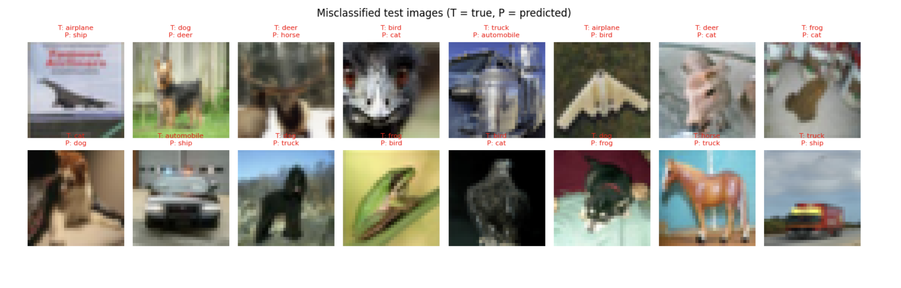

# VGG-Style CNN on CIFAR-10: Ablation of Augmentation, BatchNorm and Dropout (PyTorch)

From-scratch PyTorch implementation of a **VGG-style CNN** trained on CIFAR-10. Instead of reporting a single accuracy, I run a controlled **ablation study**: a plain baseline that overfits, then data augmentation, Batch Normalization and Dropout added step by step to measure what each one contributes.

**Kaggle notebook:** _TODO: paste your Kaggle link here_
**Papers:** Krizhevsky et al., 2012 (AlexNet) · Simonyan and Zisserman, 2014 (VGG)

## Highlights
- Proper evaluation protocol: **45k train / 5k validation / 10k test**; best epoch chosen on validation, test evaluated once.
- Five controlled experiments (A to E) with identical seed and hyperparameters.
- Honest generalization gap measured on the **clean** training set (not on augmented batches).
- Error analysis: confusion matrix, per-class accuracy, misclassified samples, learned first-layer filters.

## Background: AlexNet to VGG
AlexNet (2012) popularized ReLU, Dropout, data augmentation and GPU training, but its 11x11 stride-4 first layer targets 224x224 ImageNet images. VGG (2014) simplified the design: **only 3x3 convolutions, stacked deep**, with 2x2 max-pooling and doubling channels.

Why stack 3x3 convs? Two 3x3 layers see a 5x5 region with 18C² parameters instead of 25C², and add an extra non-linearity (three 3x3 layers match a 7x7 filter with 27C² instead of 49C²). In signal-processing terms, cascading FIR filters convolves their kernels, so the effective support grows.

## Architecture (VGG-6, CIFAR-10 adaptation)

| Layer | Output shape | Params (no BN) |
|-------|--------------|----------------|
| Input | 3x32x32 | 0 |
| Conv 3->64, Conv 64->64 (+ReLU) | 64x32x32 | 1,792 + 36,928 |
| MaxPool 2x2 | 64x16x16 | 0 |
| Conv 64->128, Conv 128->128 | 128x16x16 | 73,856 + 147,584 |
| MaxPool 2x2 | 128x8x8 | 0 |
| Conv 128->256, Conv 256->256 | 256x8x8 | 295,168 + 590,080 |
| MaxPool 2x2 | 256x4x4 | 0 |
| FC 4096->512 (+ReLU, +Dropout) | 512 | 2,097,664 |
| FC 512->10 | 10 | 5,130 |
| **Total** | | **3,248,202** |

<!-- TODO: add an architecture diagram (draw.io / PowerPoint) to images/ and link it here -->

## Experiments

| ID | Augmentation | BatchNorm | Dropout |
|----|:-----------:|:---------:|:-------:|
| A: baseline | - | - | - |
| B: + augmentation | yes | - | - |
| C: + batchnorm | - | yes | - |
| D: augmentation + batchnorm | yes | yes | - |
| E: augmentation + batchnorm + dropout | yes | yes | 0.5 |

**Training setup:** Cross-Entropy, Adam (lr 1e-3), cosine schedule, 20 epochs, batch size 128, no weight decay, mixed precision, seed 42. Augmentation: random crop (padding 4) + horizontal flip.

## Results

Test accuracy is measured once, at the epoch with the best validation accuracy. "Clean train" is accuracy on the non-augmented training set in eval mode; the gap is clean train minus test.

| Config | Params | Best epoch | Val acc (%) | Test acc (%) | Clean train (%) | Gap (pp) | Time (s) |
|--------|--------|-----------|-------------|--------------|-----------------|----------|----------|
| A: baseline | 3,248,202 | 18 | 79.88 | 78.79 | 100.00 | 21.21 | 191 |
| B: + augmentation | 3,248,202 | 20 | 86.00 | 85.67 | 93.55 | 7.88 | 227 |
| C: + batchnorm | 3,249,098 | 14 | 87.46 | 85.98 | 100.00 | 14.02 | 169 |
| **D: aug + batchnorm** | 3,249,098 | 20 | **90.10** | **88.93** | 95.60 | 6.67 | 225 |
| E: aug + bn + dropout | 3,249,098 | 19 | 87.38 | 86.70 | 91.00 | 4.30 | 225 |

BatchNorm adds only 896 parameters: 2 per channel (scale and shift), minus the conv biases that become redundant (1 per channel).

**Best configuration (selected on validation): D, 88.93% test accuracy.**







<!-- Optional: add images/conv1_filters.png from the Kaggle output and uncomment

-->

## Analysis

**1. The baseline overfits severely.** Model A reaches 100% clean training accuracy but only 78.79% test accuracy, a gap of 21.2 percentage points (pp). Its validation loss bottoms out around epoch 5 (about 0.7) and then climbs to about 1.8, while validation accuracy keeps creeping up to about 80%. In other words, the network becomes increasingly overconfident on its mistakes, so accuracy alone hides the overfitting and the validation loss curve is essential.

**2. Every technique helped.** Test accuracy gains over the baseline: augmentation +6.9 pp (B), BatchNorm +7.2 pp (C), both together +10.1 pp (D), and both plus dropout +7.9 pp (E).

**3. Augmentation and BatchNorm solve different problems.**
- *BatchNorm* mainly improves optimization: validation accuracy is higher from the early epochs and the validation loss stays flat near 0.6 instead of exploding. But the network still memorizes the training set (100% clean train accuracy), so a 14.0 pp gap remains.
- *Augmentation* prevents memorization: clean train accuracy is only 93.6%, validation loss is still decreasing at epoch 20, and the gap drops to 7.9 pp.
- Between the two, BatchNorm is slightly ahead on test accuracy (85.98% vs 85.67%), but a 0.3 pp difference is within noise (see limitations), so I do not rank them.

**4. The gains are sub-additive.** B and C individually add 6.9 and 7.2 pp, which would sum to 14.1 pp, but combined (D) they add 10.1 pp. The two techniques partly overlap, so each one gives less once the other is present.

**5. Dropout hurt in this setup.** Adding dropout (p = 0.5) to the best configuration lowered test accuracy from 88.93% to 86.70% (−2.2 pp), even though E has the smallest generalization gap (4.3 pp). Its clean training accuracy is only 91.0%, and in the curves the validation accuracy sits *above* the training accuracy (the training numbers are measured with augmentation and dropout active). This is an underfitting regime: a small gap is not the goal, a low test error is. A plausible explanation is that p = 0.5 plus augmentation is too much regularization for a small network and a 20-epoch budget. I have not tested a lower rate (0.2 to 0.3) or a longer schedule, so this remains a hypothesis.

**6. The model is probably undertrained.** The best epoch of both B and D is the last one (epoch 20), and their validation loss is still decreasing. A longer schedule would likely improve the augmented runs further.

**7. Error analysis (best model, D).**
- *Hardest classes:* cat (77.2% recall), dog (82.5%), bird (84.0%). *Easiest:* automobile (95.3%), truck (94.4%), ship (94.4%).
- The top two confusions are **dog → cat (102)** and **cat → dog (88)**: these 190 errors make up about 17% of all 1,107 test errors. Other frequent confusions: bird → cat (39), cat → deer (39), airplane → ship (39), and automobile ↔ truck (26 each way).
- Errors concentrate inside groups of visually similar classes (four-legged animals, vehicles). A plausible reason is the 32×32 resolution: fine details such as ears and snouts are mostly lost, while pose, fur texture and background vary a lot. Airplane/ship confusions may come from similar sky and water backgrounds (also a hypothesis).
- The misclassified samples are a mix of genuinely hard cases (a toy horse figurine predicted as truck, a close-up of a bird's head predicted as cat, unusual crops) and clear model failures (a dog standing on grass predicted as deer).

**8. Cost.** Augmentation made runs about 20 to 30% slower (225 to 227 s vs 169 to 191 s), likely because cropping and flipping run on the CPU data loader.

## Limitations
- Single run per configuration (one seed). The difference between validation and test accuracy is 0.3 to 1.5 pp across runs, which gives a rough sense of the noise level, so differences of about 1 pp or less (for example B vs C) are not conclusive.
- Only one dropout rate and one 20-epoch schedule were tested, so conclusions about dropout are limited to this setup.
- A small 6-layer VGG-style network, not the full ImageNet VGG-16. No weight decay, no tuning of learning rate, no advanced augmentation (Cutout, MixUp).

## What I would improve
- Run 3 to 5 seeds per configuration and report mean ± std
- Test dropout rates 0.2 to 0.3 and a longer schedule (40 to 60 epochs)
- Add weight decay and label smoothing; try Cutout or AutoAugment
- Try `ARCH = "vgg11"` to study the effect of depth


## What I learned
- Accuracy alone can hide overfitting: the baseline's validation loss rose from about 0.7 to 1.8 while its validation accuracy kept increasing.
- BatchNorm and augmentation fix different things (optimization vs memorization), and their gains are sub-additive.
- A smaller generalization gap does not mean a better model: dropout gave the smallest gap but lower test accuracy.
- Proper evaluation matters: a separate validation set for model selection, a clean-data train accuracy for the gap, and awareness of the noise level before ranking close results.

## Reproduce
```bash
pip install -r requirements.txt
jupyter notebook vgg_cifar10_ablation.ipynb   # or run on Kaggle with GPU + Internet on
```

## References
- Krizhevsky, Sutskever, Hinton (2012). ImageNet Classification with Deep Convolutional Neural Networks. NeurIPS.
- Simonyan, Zisserman (2014). Very Deep Convolutional Networks for Large-Scale Image Recognition. arXiv:1409.1556.
- Ioffe, Szegedy (2015). Batch Normalization. ICML.
- Srivastava et al. (2014). Dropout. JMLR.
