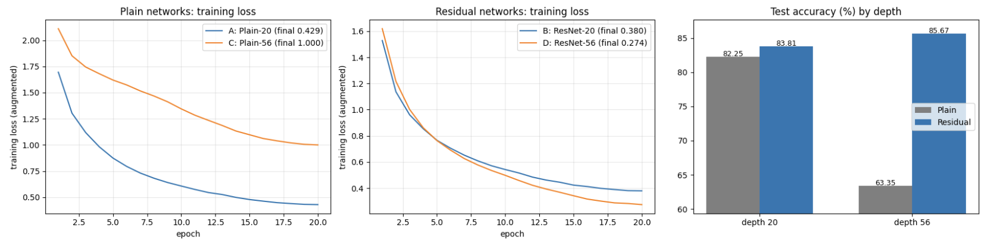
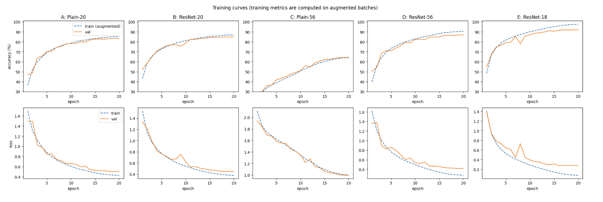
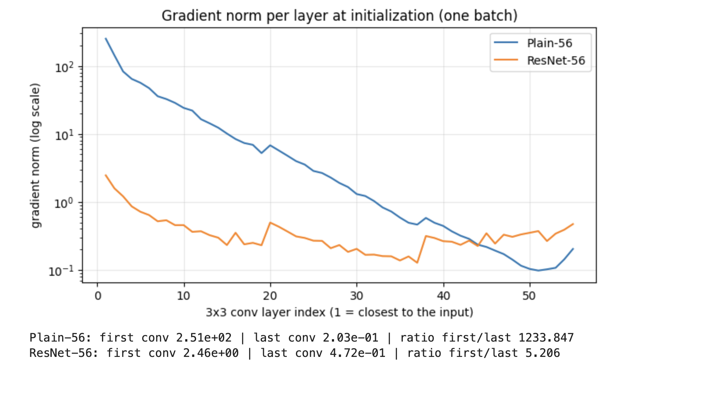
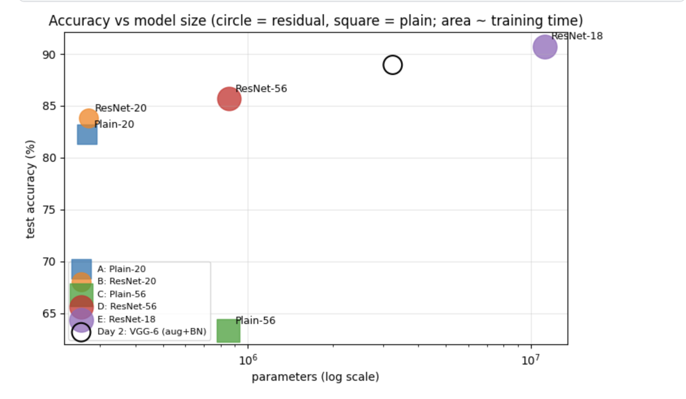
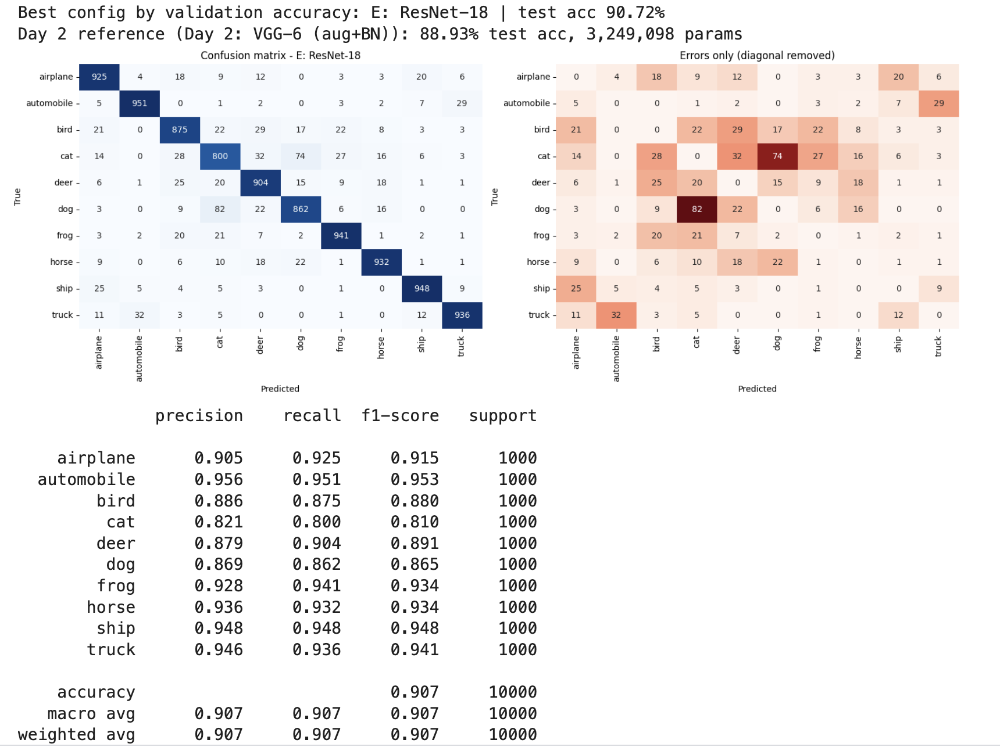
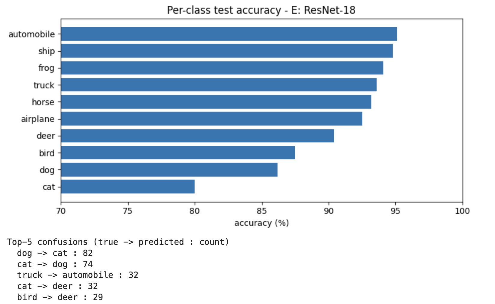
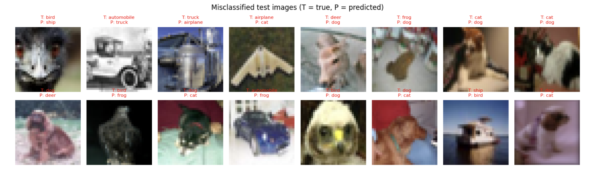

# ResNet from Scratch on CIFAR-10: Plain vs Residual Networks (PyTorch)

From-scratch PyTorch implementation of **ResNet** (He et al., 2015). Every residual network is paired with an otherwise identical **plain** network (same layers, no skip connections) at two depths, to test whether skip connections really make deep networks easier to train. A full **ResNet-18** is then compared against the best VGG-style model from Day 2.

**Kaggle notebook:** _TODO: paste your Kaggle link here_
**Paper:** *Deep Residual Learning for Image Recognition* (He, Zhang, Ren, Sun, 2015)

## Highlights
- One configurable `CifarNet` class builds all five networks; a single flag removes the skip connections, so the plain-vs-residual comparison is controlled.
- Degradation study at depth 20 vs 56, looking at **training** loss (not only test accuracy).
- Gradient-flow analysis: gradient norm per layer at initialization for Plain-56 vs ResNet-56.
- Same split, seed, augmentation and training protocol as Day 2, so ResNet-18 can be compared directly with the VGG-style model.
- Error analysis: confusion matrix, per-class accuracy, misclassified samples.

## Background

**Degradation problem.** Deeper plain networks can have higher *training* error than shallower ones. This is an optimization problem, not overfitting.

**Residual learning.** Each block learns a residual F(x) and adds the input back:

```
y = ReLU(F(x) + x)        dy/dx = I + dF/dx
```

The identity term gives the gradient a direct path through every block, and a block that should do nothing only needs to push F(x) toward zero.

## Architectures

| Network | Depth | Blocks per stage | Channels | Skip | Params |
|---------|-------|------------------|----------|------|--------|
| Plain-20 | 20 | 3, 3, 3 | 16, 32, 64 | no | 269,722 |
| ResNet-20 | 20 | 3, 3, 3 | 16, 32, 64 | yes | 272,474 |
| Plain-56 | 56 | 9, 9, 9 | 16, 32, 64 | no | 853,018 |
| ResNet-56 | 56 | 9, 9, 9 | 16, 32, 64 | yes | 855,770 |
| ResNet-18 | 18 | 2, 2, 2, 2 | 64, 128, 256, 512 | yes | 11,173,962 |

- **Basic block:** `Conv3x3 -> BN -> ReLU -> Conv3x3 -> BN`, add shortcut, ReLU.
- **Shortcut:** identity when shapes match, 1x1 conv + BN projection when channels or stride change (this is why the residual networks have slightly more parameters than their plain twins).
- **ResNet-18 for CIFAR:** 3x3 stride-1 stem and no max-pool (the 7x7 stride-2 stem + max-pool of the ImageNet version is meant for 224x224 inputs).

**ResNet-18 layout**

| Stage | Output shape |
|-------|--------------|
| Stem: Conv3x3 (3 -> 64) + BN + ReLU | 64x32x32 |
| Stage 1: 2 blocks, 64 channels | 64x32x32 |
| Stage 2: 2 blocks, 128 channels (stride 2) | 128x16x16 |
| Stage 3: 2 blocks, 256 channels (stride 2) | 256x8x8 |
| Stage 4: 2 blocks, 512 channels (stride 2) | 512x4x4 |
| Global average pool + Linear | 10 |

<!-- TODO: add a diagram of the residual block to images/ and link it here -->

## Experiments and training setup

| ID | Network |
|----|---------|
| A | Plain-20 |
| B | ResNet-20 |
| C | Plain-56 |
| D | ResNet-56 |
| E | ResNet-18 |

- **Data:** CIFAR-10, 45k train / 5k validation / 10k test; best epoch chosen on validation, test evaluated once.
- **Training:** Cross-Entropy, Adam (lr 1e-3), cosine schedule, 20 epochs, batch size 128, no weight decay, mixed precision, seed 42.
- **Augmentation (all runs):** random crop (padding 4) + horizontal flip.

## Results

Test accuracy is measured once, at the epoch with the best validation accuracy. "Clean train" is accuracy on the non-augmented training set in eval mode; the gap is clean train minus test.

| Config | Depth | Skip | Params | Best epoch | Val acc (%) | Test acc (%) | Clean train (%) | Gap (pp) | Final train loss | Time (s) |
|--------|-------|------|--------|-----------|-------------|--------------|-----------------|----------|------------------|----------|
| A: Plain-20 | 20 | no | 269,722 | 19 | 83.34 | 82.25 | 86.36 | 4.11 | 0.429 | 248 |
| B: ResNet-20 | 20 | yes | 272,474 | 20 | 84.86 | 83.81 | 88.10 | 4.29 | 0.380 | 234 |
| C: Plain-56 | 56 | no | 853,018 | 20 | 64.40 | 63.35 | 65.81 | 2.46 | 1.000 | 323 |
| D: ResNet-56 | 56 | yes | 855,770 | 20 | 86.96 | 85.67 | 91.78 | 6.11 | 0.274 | 359 |
| **E: ResNet-18** | 18 | yes | 11,173,962 | 20 | **92.10** | **90.72** | 98.17 | 7.45 | 0.074 | 371 |
| _Day 2: VGG-6 (aug + BN)_ | 8 | no | 3,249,098 | 20 | 90.10 | 88.93 | 95.60 | 6.67 | | 225 |

**Best configuration (selected on validation): ResNet-18, 90.72% test accuracy.**









## Analysis

**1. The degradation problem is clearly visible.** Plain-56 ends with a training loss of 1.000 and a clean training accuracy of 65.81%, while Plain-20 reaches 0.429 and 86.36%. The deeper plain network fits the *training* data about 20 pp worse, and its test accuracy drops from 82.25% to 63.35%. The train-test gap is small (2.5 pp vs 4.1 pp) and the train and validation curves of Plain-56 overlap, so this is not overfitting: the deeper network is simply much harder to optimize.

**2. Skip connections remove the penalty of depth.** With skip connections the ordering reverses: ResNet-56 has a lower training loss than ResNet-20 (0.274 vs 0.380) and higher test accuracy (85.67% vs 83.81%, +1.9 pp). At depth 56, the residual network beats its plain twin by 22.3 pp (85.67% vs 63.35%) with the same layers. At depth 20 the benefit is small: +1.6 pp test accuracy (83.81% vs 82.25%), +1.5 pp validation, and a lower training loss (0.380 vs 0.429). These agree with each other, but with one seed I treat the depth-20 difference as suggestive, not conclusive.

**3. Caveat: this is a 20-epoch result.** Plain-56's loss is still decreasing at the end of training, so what I measured is that, within this budget (Adam, 20 epochs, BatchNorm), the plain network optimizes far more slowly. That is consistent with the degradation claim, but it does not show that Plain-56 could never reach a lower error with a longer schedule. The size of the gap probably reflects the short budget; I did not test longer schedules.

**4. Gradient flow: the opposite of vanishing.** At initialization, Plain-56's gradient norm is 2.51e2 at the first conv and 2.03e-1 at the last (ratio about 1,234), while ResNet-56 has 2.46 and 0.472 (ratio about 5.2). I expected the plain network's gradients to vanish toward the input; instead they *grow* by roughly three orders of magnitude going backward. In the residual network the gradient scale stays within about one order of magnitude across all 55 layers. So skip connections keep the gradient scale uniform across depth, whereas the plain network has very uneven scales, which may make optimization harder. I did not test this causal link, and the analysis uses a single batch at initialization (BatchNorm and Kaiming initialization probably shape the result as well).

**5. ResNet-18 vs the Day 2 VGG-style network.** ResNet-18 reaches 90.72% test accuracy vs 88.93% for the Day 2 model (+1.8 pp; validation 92.10% vs 90.10%), with 3.4x the parameters (11.17M vs 3.25M) and about 1.6x the training time (371 s vs 225 s, measured in different sessions, so only roughly comparable). It fits the training data more tightly (clean train accuracy 98.17% vs 95.60%) and has a slightly larger gap (7.45 pp vs 6.67 pp). Its best epoch is the last one and its validation loss is still decreasing, so it is probably undertrained. Interestingly, ResNet-56 (85.67%) is below the shallower VGG-style model (88.93%): depth alone is not enough, and the thin 16-to-64-channel layout of ResNet-56 (0.86M parameters) may be a limiting factor (a hypothesis I did not isolate).

**6. Cost of depth.** Going from ResNet-20 to ResNet-56 triples the parameters (0.27M to 0.86M) and takes about 1.5x longer (234 s to 359 s). ResNet-18 has 13x more parameters than ResNet-56 but takes about the same time (371 s vs 359 s), so very deep thin networks are slow for their size, plausibly because their layers must run one after another.

**7. Error analysis (ResNet-18).**
- *Hardest classes:* cat (80.0% recall, up from 77.2% on Day 2), dog (86.2%, up from 82.5%), bird (87.5%, up from 84.0%). *Easiest:* automobile (95.1%), ship (94.8%), frog (94.1%).
- The top confusions are still **dog → cat (82)** and **cat → dog (74)**: 156 errors, about 17% of all test errors, almost the same share as on Day 2 (190 errors, also about 17%). The improvement is spread across classes, and cat/dog remains the bottleneck. Truck ↔ automobile confusions went slightly up (32 + 29 = 61 vs 26 + 26 = 52 on Day 2), which is within what a single seed can change.
- Among the first 16 misclassified images, at least five look like the same test images the Day 2 model also got wrong (the emu close-up, the blue truck, the delta-wing aircraft, the pinkish deer, the frog on a white background), yet the two models predict different wrong classes for them (for example the emu is predicted as cat on Day 2 and as ship here). This suggests these samples are intrinsically hard or ambiguous at 32x32 resolution, not mistakes specific to one architecture (a hypothesis based on visual inspection).

## Limitations
- Single run per configuration (one seed): differences of about 1 pp or less (for example plain vs residual at depth 20) are not conclusive.
- 20 epochs with Adam and no weight decay is shorter and different from the paper's SGD schedule, so absolute accuracies are below published results, and Plain-56 was not trained to convergence.
- Only two depths for the degradation study; the gradient analysis uses one batch at initialization.
- Test accuracy in the table is computed under mixed precision, while the confusion matrix is computed in full precision, which differs by 2 images (90.72% vs 90.74%). Training times come from separate Kaggle sessions and are only roughly comparable.

## What I would improve
- Train longer with SGD + momentum + weight decay; run 3 to 5 seeds and report mean ± std
- Train Plain-56 much longer to see whether it eventually catches up
- Add depths 32 and 110; try pre-activation ResNet and zero-init of the last BatchNorm in each block
- Use Grad-CAM to inspect what ResNet-18 looks at on the cat/dog errors


## What I learned
- Degradation is an optimization problem, not overfitting: Plain-56 had a small train-test gap but a much worse training loss than Plain-20.
- Skip connections made depth useful: with them the deeper network is better, without them it is far worse.
- Expectations should be tested: I expected vanishing gradients in the plain network but measured gradients that grow toward the input, so the real picture is "uneven gradient scale" rather than "vanishing".
- Depth alone is not enough: ResNet-56 with thin layers lost to the shallower but wider VGG-style model from Day 2, while ResNet-18 beat both.

## Reproduce
```bash
pip install -r requirements.txt
python resnet_cifar10.py                     # script version (GPU recommended)
# or open resnet_cifar10.ipynb (Kaggle with GPU + Internet on, Colab, Jupyter)
```

## References
- He, Zhang, Ren, Sun (2015). Deep Residual Learning for Image Recognition. arXiv:1512.03385.
- He et al. (2016). Identity Mappings in Deep Residual Networks. ECCV.
- Veit, Wilber, Belongie (2016). Residual Networks Behave Like Ensembles of Relatively Shallow Networks. NeurIPS.
- Ioffe, Szegedy (2015). Batch Normalization. ICML.
