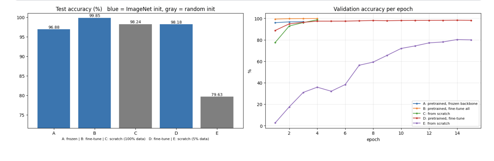
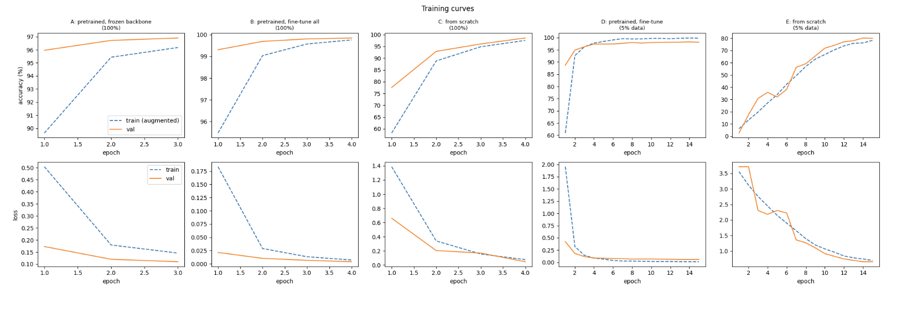
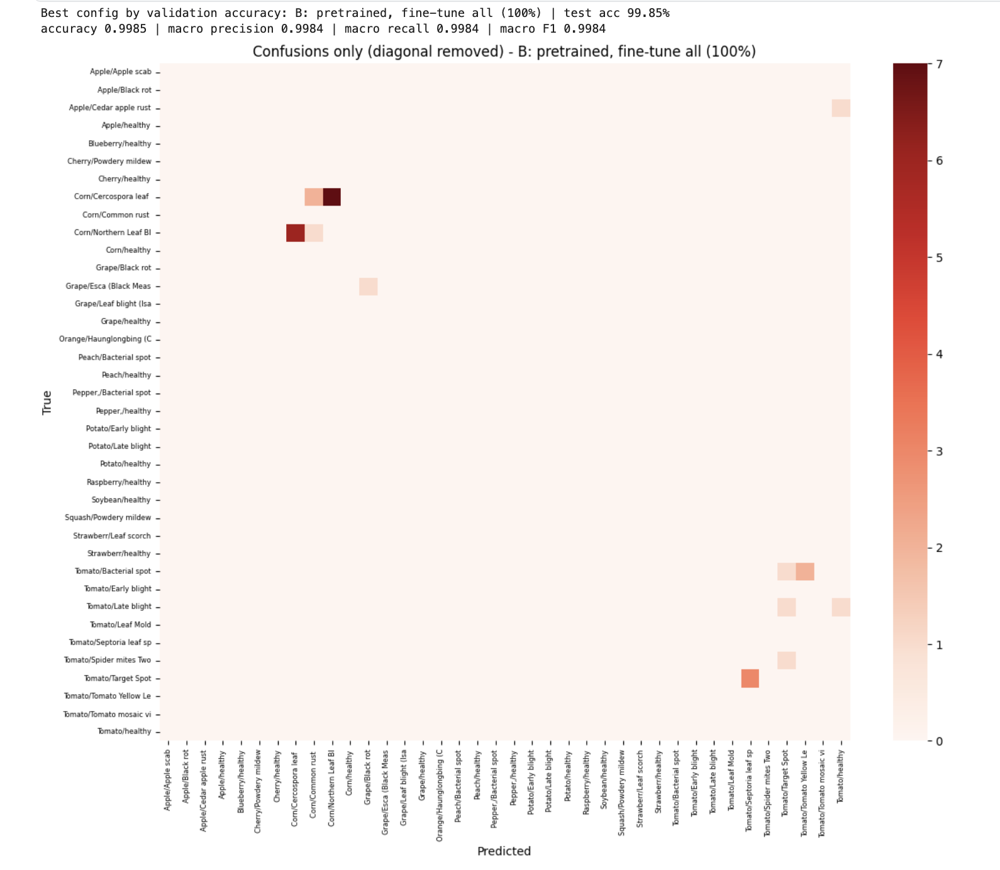
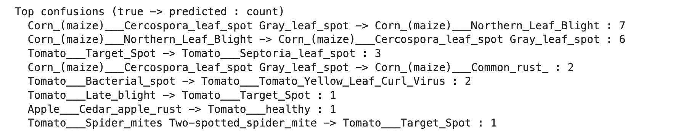
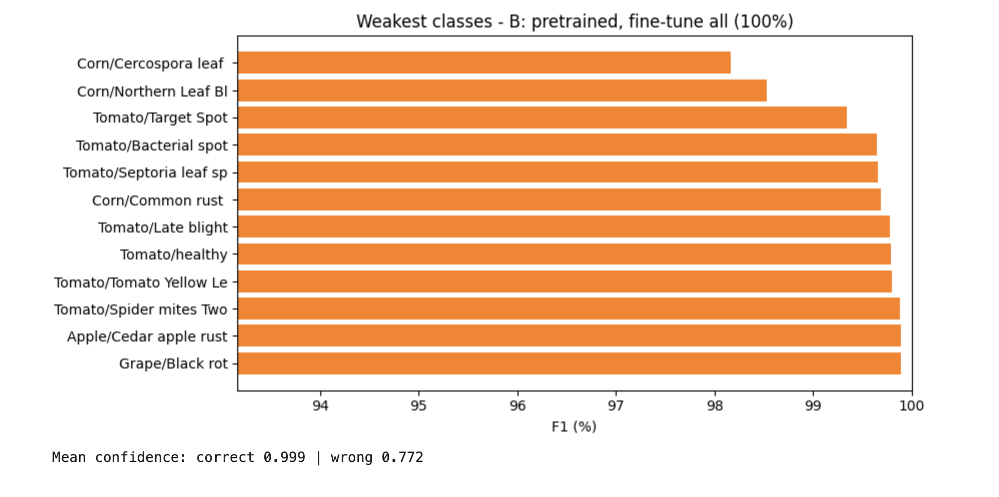
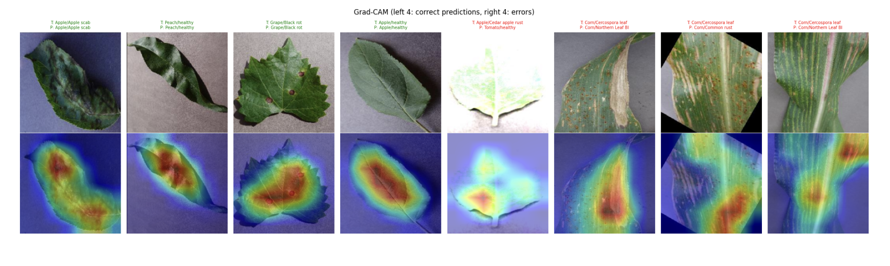
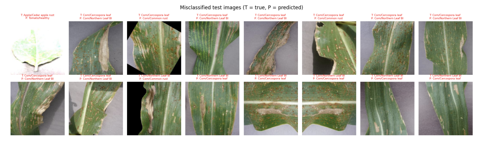

# EfficientNet Transfer Learning on Plant Disease Images (PyTorch)

Transfer learning with **EfficientNet-B0** (pretrained on ImageNet) to classify healthy and diseased crop leaves (38 classes). Instead of fine-tuning a single model, I compare *how* to transfer: a frozen backbone, full fine-tuning with discriminative learning rates, and training from scratch, each with 100% and with only 5% of the training data. Grad-CAM is used to check what the network actually looks at.

**Kaggle notebook:** _TODO: paste your Kaggle link here_
**Papers:** Tan and Le, 2019 (EfficientNet) · Sandler et al., 2018 (MobileNetV2) · Hu et al., 2018 (Squeeze-and-Excitation)

## Highlights
- Controlled comparison of five transfer-learning setups (A to E) with identical seed, splits and optimizer.
- Data-efficiency test: pretrained vs random initialization with 100% and 5% of the data.
- Own compact implementation of the **MBConv + Squeeze-and-Excitation** block, plus a parameter-count check of depthwise-separable convolution.
- Frozen-backbone training done correctly (BatchNorm of the backbone kept in eval mode).
- **Grad-CAM** analysis of lesions vs background, and an explicit discussion of dataset leakage.

## Background

**Transfer learning.** Early CNN layers learn generic features (edges, colors, textures); later layers are task-specific. Strategies: *feature extraction* (train only the new head) and *fine-tuning* (train everything, usually with a smaller learning rate for the pretrained backbone than for the new head).

**EfficientNet.** Built from **MBConv** blocks (expand 1x1 -> depthwise conv -> Squeeze-and-Excitation -> project 1x1, with a skip connection when shapes match). Depthwise-separable convolutions cut the cost of a 3x3 conv with 128 channels from 147,456 to 17,536 parameters (about 8.4x fewer). **Compound scaling** scales depth, width and resolution together:

```
d = alpha^phi,  w = beta^phi,  r = gamma^phi,   alpha * beta^2 * gamma^2 ~ 2
```

**EfficientNet-B0 layout (224x224 input)**

| Stage | Operator | Input resolution | Channels | Layers |
|-------|----------|-----------------|----------|--------|
| 1 | Conv 3x3, stride 2 | 224x224 | 32 | 1 |
| 2 | MBConv1, k3x3 | 112x112 | 16 | 1 |
| 3 | MBConv6, k3x3 | 112x112 | 24 | 2 |
| 4 | MBConv6, k5x5 | 56x56 | 40 | 2 |
| 5 | MBConv6, k3x3 | 28x28 | 80 | 3 |
| 6 | MBConv6, k5x5 | 14x14 | 112 | 3 |
| 7 | MBConv6, k5x5 | 14x14 | 192 | 4 |
| 8 | MBConv6, k3x3 | 7x7 | 320 | 1 |
| 9 | Conv 1x1, pooling, FC | 7x7 | 1280 | 1 |

The model used for training is torchvision's EfficientNet-B0 with the 1000-class head replaced by a linear layer for the 38 plant classes (about 4.06M parameters; only the head, 48,678 parameters, is trainable when the backbone is frozen).

## Dataset

**New Plant Diseases Dataset (Augmented)** on Kaggle: about 87k RGB leaf images in 38 classes, organized in `train/` and `valid/`. The code discovers the folders automatically under `/kaggle/input` (add the dataset to the notebook with "+ Add Input").

- Official `train/` -> stratified 90% train / 10% validation (validation selects the best epoch)
- Official `valid/` -> test set, evaluated once per run

> **Data leakage caveat.** The dataset was generated by offline augmentation of the original PlantVillage images and split afterwards, so near-duplicates of the same leaf photo very likely appear in both `train/` and `valid/` (I could not verify this directly). PlantVillage photos also have controlled, uniform backgrounds. The accuracy below is therefore an **optimistic estimate** of real-world performance; I use it to compare training strategies, not to claim field readiness.

## Experiments

| ID | Initialization | Trainable parts | Training data | Epochs |
|----|----------------|-----------------|---------------|--------|
| A | ImageNet | classifier head only (frozen backbone) | 100% | 3 |
| B | ImageNet | everything (discriminative LR) | 100% | 4 |
| C | random | everything | 100% | 4 |
| D | ImageNet | everything (discriminative LR) | 5% | 15 |
| E | random | everything | 5% | 15 |

**Training setup:** Cross-Entropy, AdamW (weight decay 1e-4), cosine schedule per run, head LR 1e-3, pretrained backbone LR 2e-4 (from scratch: 1e-3 everywhere), batch size 64, 224x224 inputs, mixed precision, seed 42. Augmentation: random resized crop (scale 0.7 to 1), horizontal and vertical flips, light color jitter.

## Results

Test accuracy is measured once on the official `valid/` folder, at the epoch with the best validation accuracy.

| Config | Init | Trainable params | Train images | Epochs | Best epoch | Val acc (%) | Test acc (%) | Macro-F1 (%) | Time (s) |
|--------|------|------------------|--------------|--------|-----------|-------------|--------------|--------------|----------|
| A: frozen backbone (100%) | ImageNet | 48,678 | 63,265 | 3 | 3 | 96.90 | 96.88 | 96.85 | 430 |
| **B: fine-tune all (100%)** | ImageNet | 4,056,226 | 63,265 | 4 | 4 | **99.84** | **99.85** | **99.84** | 672 |
| C: from scratch (100%) | random | 4,056,226 | 63,265 | 4 | 4 | 98.58 | 98.24 | 98.22 | 646 |
| D: fine-tune (5% data) | ImageNet | 4,056,226 | 3,163 | 15 | 14 | 98.25 | 98.18 | 98.16 | 329 |
| E: from scratch (5% data) | random | 4,056,226 | 3,163 | 15 | 14 | 80.23 | 79.63 | 79.59 | 289 |

**Best configuration (selected on validation): B, 99.85% test accuracy.**









## Analysis

**1. Fine-tuning a pretrained EfficientNet-B0 is the best setup.** Experiment B reaches 99.85% test accuracy (macro-F1 99.84%), an error rate of 0.15%. It is already at about 99.3% validation accuracy after the *first* epoch, while the same network trained from scratch (C) starts at about 77.5%.

**2. Pretraining matters much more when data is scarce.**
- *Plenty of data (100% of the images, 4 epochs each):* pretrained 99.85% vs from scratch 98.24% (+1.6 pp). The dataset is easy enough that even a randomly initialized network gets to 98% in four epochs.
- *Scarce data (5% = 3,163 images, 15 epochs each):* pretrained 98.18% vs from scratch 79.63% (+18.5 pp).
- With only 3,163 training images, the pretrained model (D, 98.18%) matches the from-scratch model trained on 20 times more data (C, 98.24%) and takes about half the wall-clock time (329 s vs 646 s).
- Caveat: both from-scratch runs are still improving at the end of training (E's validation accuracy is still climbing steeply at epoch 15), so these gaps compare **equal budgets**, not converged models, and the long-run gap is likely smaller than 18.5 pp (a hypothesis I did not test).

**3. Fine-tuning beats feature extraction, but ImageNet features are already strong.** Training only the 48,678-parameter head (A) gives 96.88%, which shows that ImageNet features are already informative for leaf diseases. Fine-tuning all 4.06M parameters (B) raises this to 99.85%, reducing the error rate from 3.1% to 0.15% (about 21 times fewer errors) at 83 times more trainable parameters and about 1.6 times the training time. One confound: A was trained for 3 epochs and B for 4. Interestingly, the frozen model (96.88%) is *below* the from-scratch model with the same data (98.24%): with plenty of data and a domain that differs from ImageNet, frozen features are not enough, whereas with little data pretraining is essential.

**4. Freezing the backbone saved little time.** A took about 143 s per epoch vs 168 s for B (and 162 s for C), although A skips the backward pass through the backbone. This suggests that the CPU data pipeline (JPEG decoding and augmentation) is the bottleneck, not the GPU (a hypothesis based on the timings).

**5. Errors are fine-grained confusions inside the same crop.** The weakest classes are Corn Cercospora leaf spot (F1 about 98.2%), Corn Northern Leaf Blight (about 98.5%) and Tomato Target Spot (about 99.3%); all other listed classes are above 99.6%. The two largest confusions are Cercospora → Northern Leaf Blight (7) and Northern Leaf Blight → Cercospora (6): together 13 of the 23 errors in the top-8 confusion list. Both are fungal diseases of maize with elongated lesions, so a visual similarity is plausible (my interpretation). Tomato Target Spot → Septoria leaf spot (3) and Tomato Bacterial spot → Yellow Leaf Curl Virus (2) follow. Only one of the top-8 confusions crosses crops (Apple Cedar rust → Tomato healthy), so the model almost always identifies the crop correctly and errs on the disease.

**6. Confidence separates errors from correct predictions, but not perfectly.** The mean confidence is 0.999 on correct predictions and 0.772 on errors, so a confidence threshold could flag many risky predictions for human review. An average of 0.77 on errors still means the model is often confidently wrong.

**7. Grad-CAM.** On the correctly classified examples (apple scab, healthy peach, grape black rot, healthy apple), the heat concentrates on the leaf itself and on its lesions, and the background is mostly cold. For healthy leaves the heat covers the leaf body rather than a specific spot, as expected. On the errors, the maps are more diffuse (the overexposed apple leaf) or focus on the lower part of the corn leaf. Two cautions: the maps are coarse (7×7 feature maps upsampled), and I only looked at eight images. In this dataset the background color also varies by crop (blue-gray, beige, gray), so the model could in principle use background cues as well; Grad-CAM on a few samples does not rule this out.

**8. The test set visibly contains augmented images.** In the misclassified samples I can see rotated crops with black corners, an over-exposed leaf, and what look like two mirrored copies of the same corn leaf, which indicates offline augmentation. Together with the fact that validation (a split of the training folder) and test (the official `valid/` folder) accuracies are almost identical in every run (for example 99.84% vs 99.85%), this is consistent with the leakage concern: near-duplicates of the same leaf probably exist on both sides of the split. I did not verify duplicates directly, so the leakage is a **strong suspicion, not a measurement**, and the accuracy should be read as optimistic. It may also help the 5% runs more than the 100% runs, since a small subset of a pool full of augmented copies can still cover many test leaves (a hypothesis).

**9. A note on the error samples.** The misclassified grid shows the first 16 errors in test-set order, and the test set is sorted by class, so it is dominated by the first classes (apple, corn) and is not a random sample of all errors; the confusion matrix and the top-confusion list give the correct overall picture.

## Limitations
- Single run per configuration (one seed); differences of a few tenths of a point, such as C vs D, are not conclusive.
- Very short training budgets (3 to 15 epochs): the from-scratch models are clearly undertrained, so the comparison reflects equal compute, not convergence. A used 3 epochs and B used 4.
- Offline-augmented, lab-style images with probable train/valid near-duplicates: accuracy is optimistic and says little about field performance.
- The 5% subset is a single stratified draw; only EfficientNet-B0 at 224×224; no hyperparameter search.

## What I would improve
- Evaluate on an independent in-the-wild dataset (for example PlantDoc or a Plant Pathology competition set) to measure the real domain gap
- Use the original unaugmented images with a group-aware split, or detect near-duplicates between train and valid with image embeddings
- Test with background-masked or background-swapped images to check for shortcut learning
- Train the from-scratch runs to convergence; run several seeds and several data fractions (1%, 5%, 20%, 100%) to draw a full data-efficiency curve
- Progressive unfreezing, label smoothing, larger EfficientNets, calibration of the confidence scores


## What I learned
- The value of pretraining depends on how much data you have: +1.6 pp with 100% of the data at equal epochs, but +18.5 pp with 5% (and a 5% pretrained model matches a from-scratch model trained on 20 times more data).
- Fine-tuning beats feature extraction even when ImageNet features are already good (96.9% to 99.85%), and a frozen backbone needs its BatchNorm layers in eval mode.
- Freezing saved little time because the CPU data pipeline was the bottleneck, so profiling matters before optimizing.
- A very high accuracy is not automatically a good result: visible augmentation artifacts and near-identical validation and test scores point to a leaky benchmark, so I report the numbers as optimistic.
- Errors concentrate on fine-grained disease pairs within the same crop, and Grad-CAM showed the model mostly looks at the leaf.

## Reproduce
```bash
pip install -r requirements.txt
python efficientnet_plant_disease.py    # needs the dataset under /kaggle/input, a GPU, and internet for pretrained weights
# or open efficientnet_plant_disease.ipynb on Kaggle (GPU + Internet on, dataset added as input)
```

## References
- Tan, Le (2019). EfficientNet: Rethinking Model Scaling for Convolutional Neural Networks. ICML.
- Sandler et al. (2018). MobileNetV2: Inverted Residuals and Linear Bottlenecks. CVPR.
- Hu, Shen, Sun (2018). Squeeze-and-Excitation Networks. CVPR.
- Selvaraju et al. (2017). Grad-CAM: Visual Explanations from Deep Networks via Gradient-based Localization. ICCV.
- Hughes, Salathe (2015). An open access repository of images on plant health (PlantVillage). arXiv:1511.08060.
